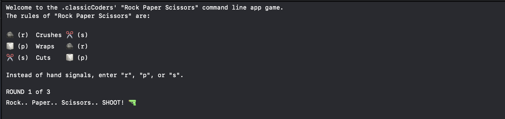
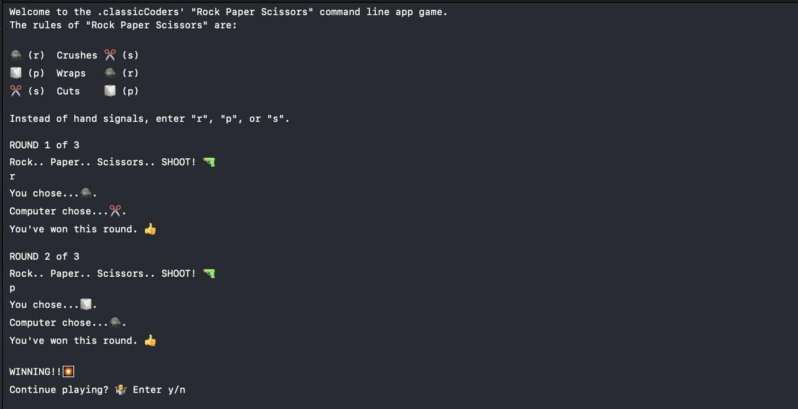
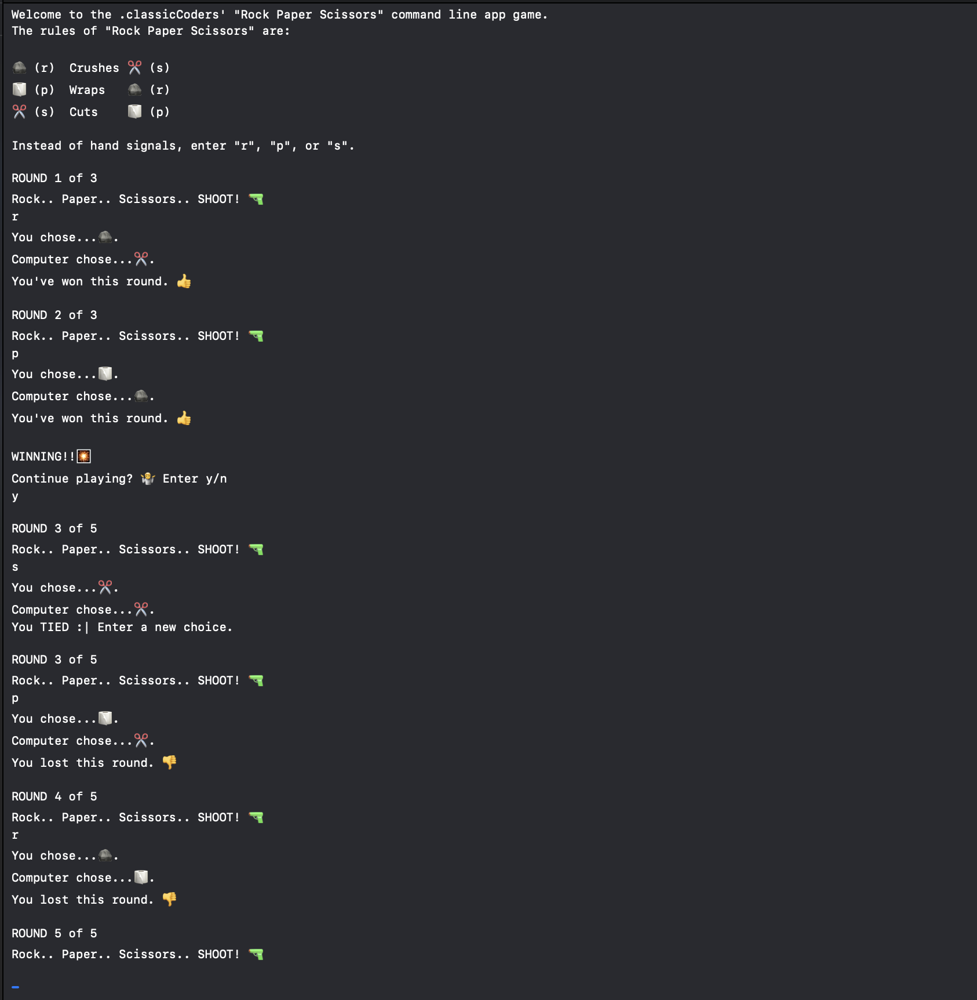

# Rock, Paper, Scissors (Command Line Game) by classicCoders

At the MSU Apple Developer Academy in 

## Background

This command line game of Rock, Paper, Scissors was created as part of Challenge 3 at the MSU Apple Developer Academy, where are challenge was to create a classic game in the command line using Swift. My team, classic Coders, chose to recreate Rock Paper Scissors. My team and I put this together by Mob Coding everyday with one another to not only build this game that eveyone knows, but also design it in a way that it is still very understandle, readable, and pleasant to look at from our players.

## Lessons Learned

This challenge taught me a lot about collaborating with other on the same computer using Mob Coding, i was able to learn things and get a better understanding on concepts I was still struggling with such as Structs and Enums during the development process.
## Acknowledgements

I would like to thank my team classic Coders for all being amazing and respectful during the creation of this game. Mob coding was very new to at least me, and my teammates made the experience smooth and nonproblematic. We were able to discuss like adults our opinions and created something that i believe looks nice and clean.
## Authors

- [Davaughn Williams](https://www.github.com/313rdWay)
- Andi Powell
- Linda Swanson
- Cameron Szabo

## Screenshots

